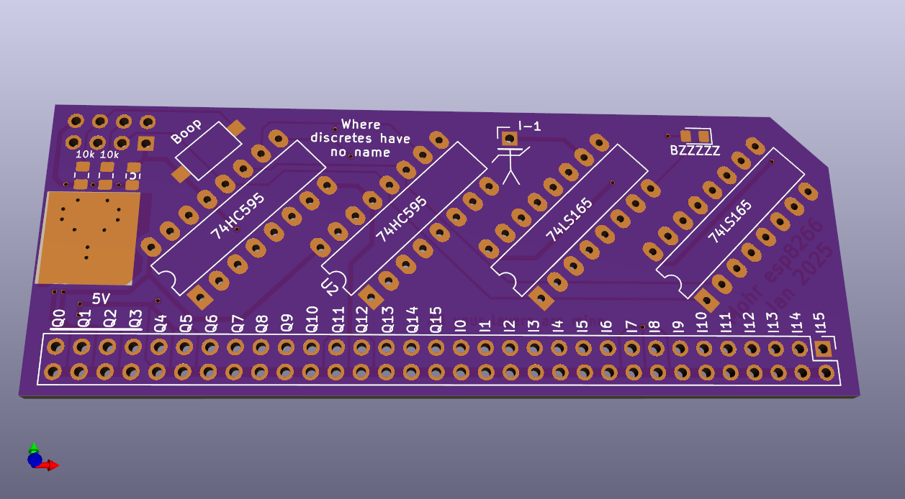
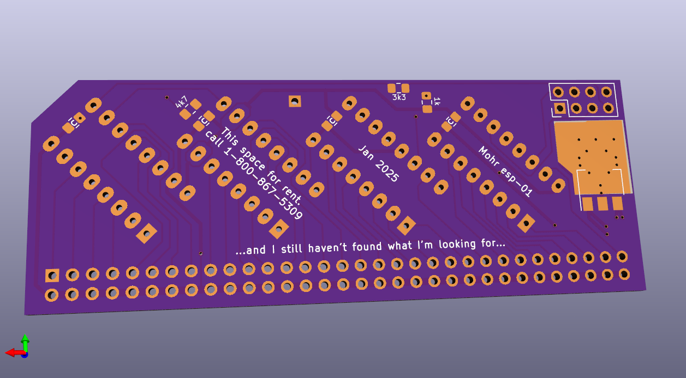
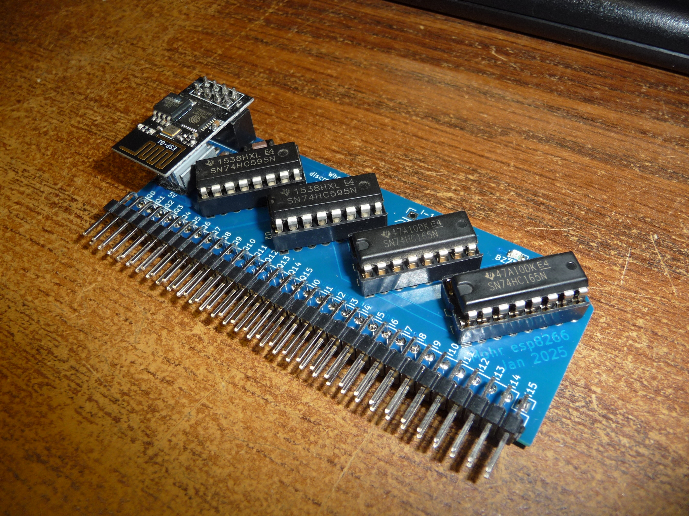
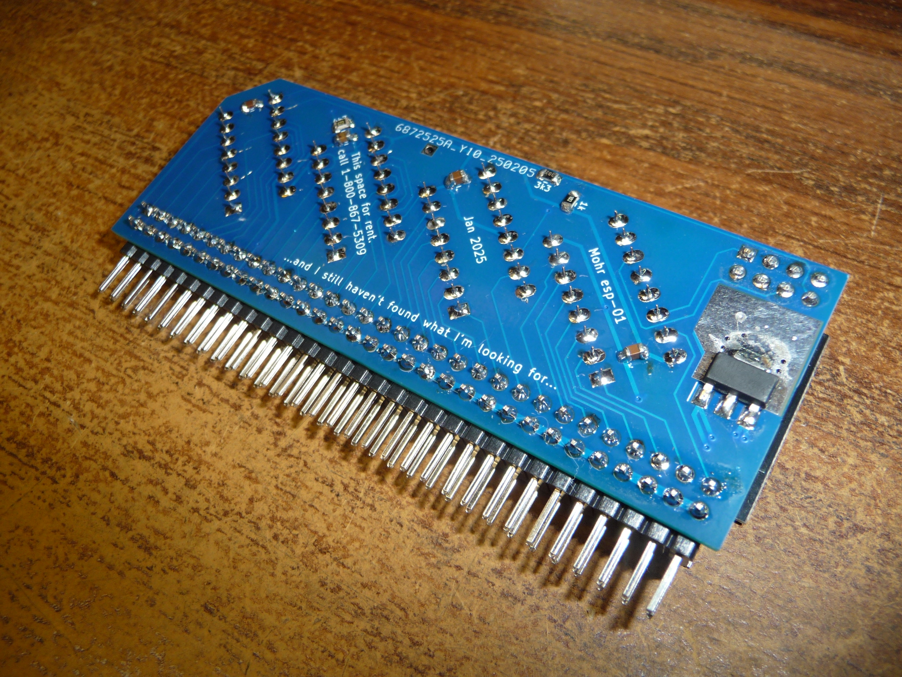

# esp_01Expand32
esp-01 (esp8266) IO expander, 16 output, 16 input = 32

internet inspired esp-01 (esp8266) IO expander.

This uses DIP (socket and replace if you oops) 74xx595 and 74xx165 chips to give you 16 inputs and 16 outputs from an esp-01

Why not just use i2c?

 WELL, the i2c chips have realy primitive IO circuits, and you cannot have a high impedence input. This means you can't tie into analog circuits like RC pairs to give you time delays, which is something important to me.
 
 
 You also can't properly drive an output high, this is also important to me.

The zip file is all the gerber files to have it made.

The regultor is an AMS1117-3.3

